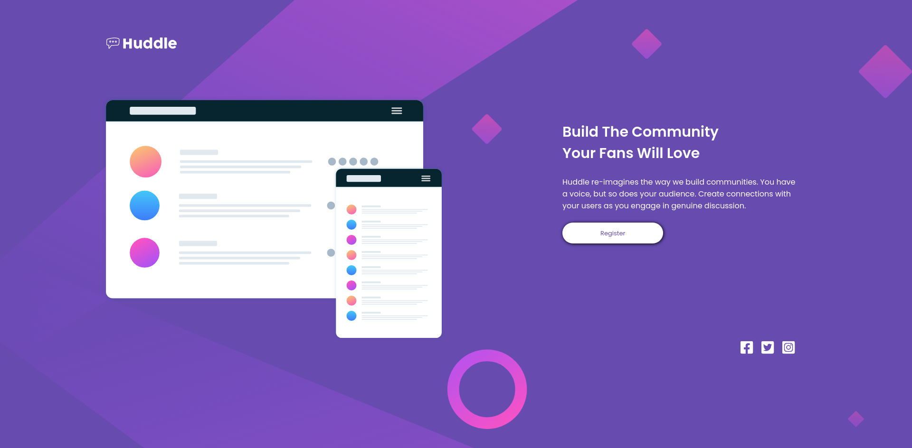

# Frontend Mentor - Huddle landing page with single introductory section solution

This is a solution to the [Huddle landing page with single introductory section challenge on Frontend Mentor](https://www.frontendmentor.io/challenges/huddle-landing-page-with-a-single-introductory-section-B_2Wvxgi0).

## Table of contents

- [Overview](#overview)
  - [The challenge](#the-challenge)
  - [Screenshot](#screenshot)
  - [Links](#links)
- [My process](#my-process)
  - [Built with](#built-with)
  - [What I learned](#what-i-learned)
  - [Useful resources](#useful-resources)
- [Author](#author)


## Overview

### The challenge

Users should be able to:

- View the optimal layout for the page depending on their device's screen size
- See hover states for all interactive elements on the page

### Screenshot



### Links

- Solution URL: [solution URL here](https://www.frontendmentor.io/solutions/responsive-mobile-first-using-sass-flexbox-and-grid-MM-CK-f61)
- Live Site URL: [live site URL here](https://costivoicu.github.io/Huddle-landing-page-with-a-single-introductory-section/)

## My process

### Built with

- Semantic HTML5 markup
- Sass variables
- Flexbox
- CSS Grid
- Mobile-first workflow

### What I learned

- How to use filter for a svg image:

```css
  filter: invert(98%) sepia(4%) saturate(0%) hue-rotate(250deg) brightness(101%) contrast(101%);
```

### Useful resources

-[How to change the color of an svg element?](https://stackoverflow.com/questions/22252472/how-to-change-the-color-of-an-svg-element#:~:text=You%20can't%20change%20the,or%20using%20inline.) - This helped me to change the color of the social icons.

## Author

- My GitHub profile - [Costi Voicu](https://github.com/CostiVoicu)
- Frontend Mentor - [@JustAFatRaccoon](https://www.frontendmentor.io/profile/JustAFatRaccoon)
- Twitter - [@VoicuCosti2](https://twitter.com/VoicuCosti2)
- Instagram - [@c0stiv0icu](https://www.instagram.com/c0stiv0icu/)
